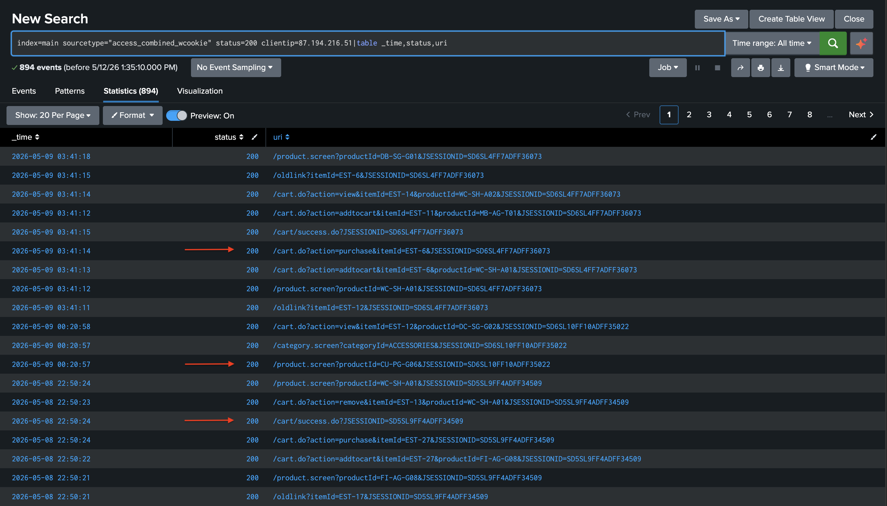
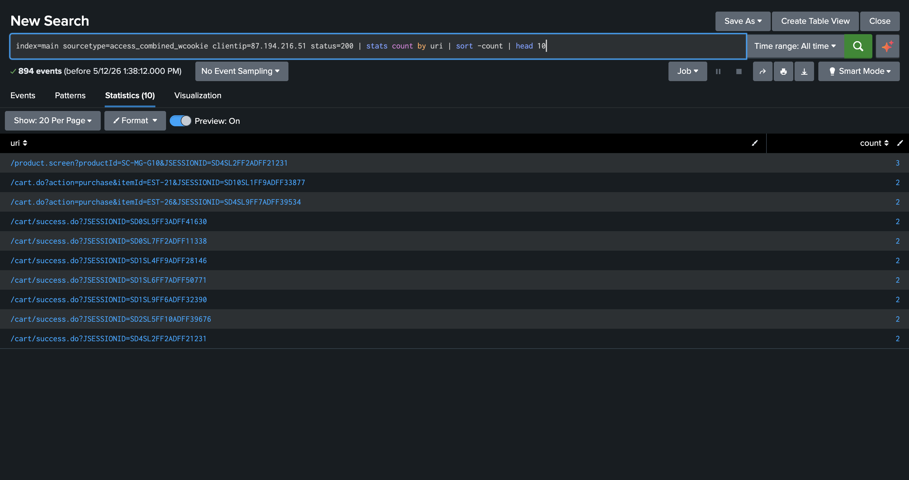
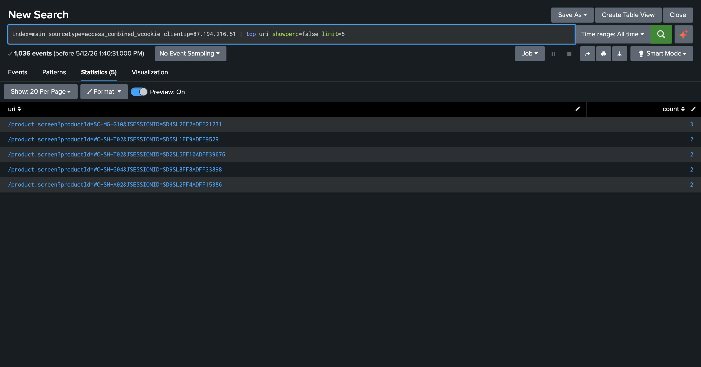
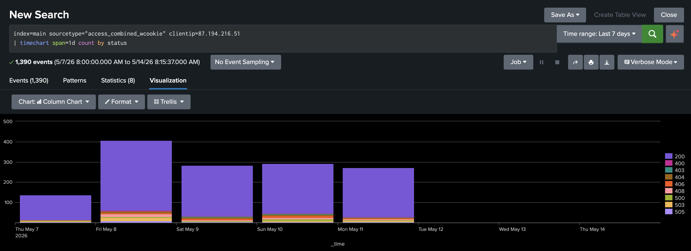
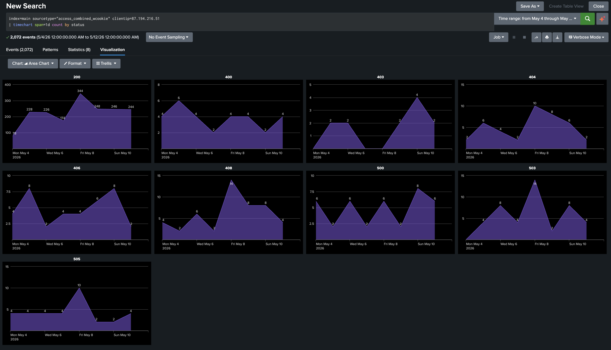

# SPL Basics — Épisode 2 : Analyse comportementale avec stats, top et timechart

> Suite de l'Épisode 1. Après avoir détecté une IP suspecte générant des erreurs 404 sur des fichiers sensibles, nous allons maintenant analyser son comportement complet en utilisant trois commandes transforming essentielles : **stats**, **top** et **timechart**.

---

## 📚 Table des matières

- [1. Contexte](#1-contexte)
- [2. Vérification des accès réussis](#2-vérification-des-accès-réussis)
- [3. Analyse avec stats — pages les plus accédées](#3-analyse-avec-stats--pages-les-plus-accédées)
- [4. Analyse avec top — confirmation](#4-analyse-avec-top--confirmation)
- [5. Analyse temporelle avec timechart](#5-analyse-temporelle-avec-timechart)
- [6. Vue détaillée par status code](#6-vue-détaillée-par-status-code)
- [7. Conclusion](#7-conclusion)
- [8. Réponse opérationnelle SOC](#8-réponse-opérationnelle-soc)

---

## 1. Contexte

Suite à la détection de l'activité de reconnaissance dans l'Épisode 1, le SOC approfondit l'investigation sur l'IP suspecte `87.194.216.51`. L'objectif est de comprendre son comportement complet — pas uniquement les erreurs 404, mais l'ensemble de ses interactions avec le serveur web de Buttercup Games.

L'attaquant n'a toujours pas trouvé `/passwords.pdf`. Mais son activité persistante sur 7 jours laisse supposer qu'il cherche une autre voie d'entrée.

---

## 2. Vérification des accès réussis

On commence par vérifier si cette IP a eu des requêtes abouties (status 200) :

```
index=main sourcetype="access_combined_wcookie" status=200 clientip=87.194.216.51
| table _time, status, uri
```

Nous obtenons **894 événements** avec status 200.

[](1.png)

La conclusion change complètement par rapport à l'épisode 1. Cette IP n'est pas uniquement en reconnaissance — elle utilise activement le site. On peut voir dans les résultats :

| URI | Signification |
|-----|--------------|
| `/cart.do?action=purchase` | Achats effectués |
| `/cart/success.do` | Transactions abouties |
| `/product.screen` | Consultation de pages produits |

> ⚠️ **894 accès réussis contre seulement 20 erreurs 404.** Cette IP se fond dans le trafic légitime tout en sondant des fichiers sensibles en parallèle.

---

## 3. Analyse avec `| stats` — pages les plus accédées

Pour transformer ces 894 événements en données exploitables, on utilise `| stats` pour compter les accès par URI :

```
index=main sourcetype="access_combined_wcookie" status=200 clientip=87.194.216.51
| stats count by uri
| sort -count
| head 10
```

**Ce que fait cette commande :**

- `stats count by uri` — compte le nombre d'accès par page
- `sort -count` — trie du plus grand au plus petit (le signe `-` = décroissant)
- `head 10` — garde les 10 premiers résultats

[](2.png)

Les résultats confirment que l'IP accède principalement à des pages produits et effectue des transactions réelles.

---

## 4. Analyse avec `| top` — confirmation

On utilise `| top` pour confirmer les URIs les plus fréquentes sur l'ensemble de l'activité de cette IP, tous status confondus :

```
index=main sourcetype="access_combined_wcookie" clientip=87.194.216.51
| top uri showperc=false limit=5
```

**Ce que fait cette commande :**

- `top uri` — retourne automatiquement les valeurs les plus fréquentes avec leur count
- `showperc=false` — supprime la colonne de pourcentage
- `limit=5` — limite aux 5 premières valeurs

[](3.png)

Les 5 URIs les plus fréquentes sont toutes des `/product.screen` — cette IP consulte massivement des pages produits spécifiques.

> 💡 **Différence entre `| stats` et `| top` :**
> `stats count` retourne uniquement le count, sans tri automatique.
> `top` retourne automatiquement count + percent + tri décroissant en une seule commande.

---

## 5. Analyse temporelle avec `| timechart`

Pour comprendre **quand** cette IP est active, on utilise `| timechart` pour visualiser l'évolution de son activité jour par jour :

```
index=main sourcetype="access_combined_wcookie" clientip=87.194.216.51
| timechart span=1d count by status
```

**Ce que fait cette commande :**

- `timechart` — génère une visualisation temporelle (l'axe X est **toujours** le temps)
- `span=1d` — regroupe les événements par jour
- `count by status` — crée une série par status code

[](4.png)

**Ce que le graphique révèle :**

| Observation | Interprétation |
|------------|---------------|
| Activité du 5 au 12 mai | 7 jours consécutifs sans interruption |
| Pic le vendredi 8 mai (~340 events) | Journée la plus active |
| Activité le week-end | Comportement atypique pour un utilisateur légitime |
| Status 200 dominant | L'activité normale masque la reconnaissance |

> ⚠️ **Une activité régulière 7j/7 sans pause week-end est un indicateur comportemental important.** Un utilisateur légitime fait généralement des pauses. Une activité continue sans interruption est atypique.

---

## 6. Vue détaillée par status code

En activant le mode **Trellis**, on obtient une vue comparative de chaque status code sur la même période :

[](6.png)

**Ce que cette vue apporte :**

| Status | Signification | Observation |
|--------|--------------|-------------|
| 200 | Accès réussi | 74 à 344 événements/jour — activité dominante |
| 404 | Page non trouvée | Tentatives sur `/passwords.pdf` et `/hidden/` |
| 400 | Mauvaise requête | Constant, 2 à 4/jour |
| 500 | Erreur serveur | Pic le lundi 11 mai |
| 503 | Service indisponible | Régulier, 2 à 14/jour |

> ⚠️ **Les erreurs 404 ont un pic différent des erreurs 200.** L'IP intensifie sa reconnaissance les jours où son activité "normale" est plus faible — technique délibérée pour éviter la détection.

---

## 7. Conclusion

> 🔴 **Cette IP mène une double activité simultanée.**

| Indicateur | Constat |
|-----------|---------|
| 894 accès réussis (status 200) | ✅ Utilisation active et légitime du site |
| Achats effectués (`/cart/success.do`) | ✅ Transactions réelles abouties |
| Tentatives sur `/passwords.pdf` (x3) | ❌ Ciblage répété de fichiers sensibles |
| Activité 7j/7 sans interruption | ⚠️ Comportement atypique |
| Pics de 404 décalés par rapport aux 200 | ⚠️ Reconnaissance dissimulée dans le trafic normal |

Cette IP utilise le site comme un client normal tout en sondant discrètement des fichiers sensibles en parallèle. C'est le profil d'un attaquant qui **tente de se fondre dans le trafic légitime** pour éviter la détection.

**Deux hypothèses :**

- Un **compte compromis** utilisé comme couverture par un attaquant externe
- Un **insider** qui abuse de son accès légitime pour chercher des données sensibles

---

## 8. Réponse opérationnelle SOC

### 🚧 Confinement immédiat

- Bloquer l'IP `87.194.216.51` au niveau du pare-feu
- Suspendre le compte associé aux sessions de cette IP en attendant l'investigation

### 🔔 Détection

- Créer une alerte pour toute tentative d'accès à `/passwords.pdf`
- Créer une alerte pour toute IP combinant plus de 5 erreurs 404 sur des fichiers sensibles **ET** des achats réussis
- Surveiller les IPs avec activité 7j/7 sans interruption week-end

### 🔍 Investigation complémentaire

- Identifier le compte utilisateur associé aux sessions de cette IP
- Vérifier si d'autres IPs présentent le même pattern comportemental
- Analyser les données d'achat pour détecter une éventuelle fraude

---

*Fichiers utilisés : `tutorialdata.zip` — disponible en libre accès sur la plateforme Splunk.*
